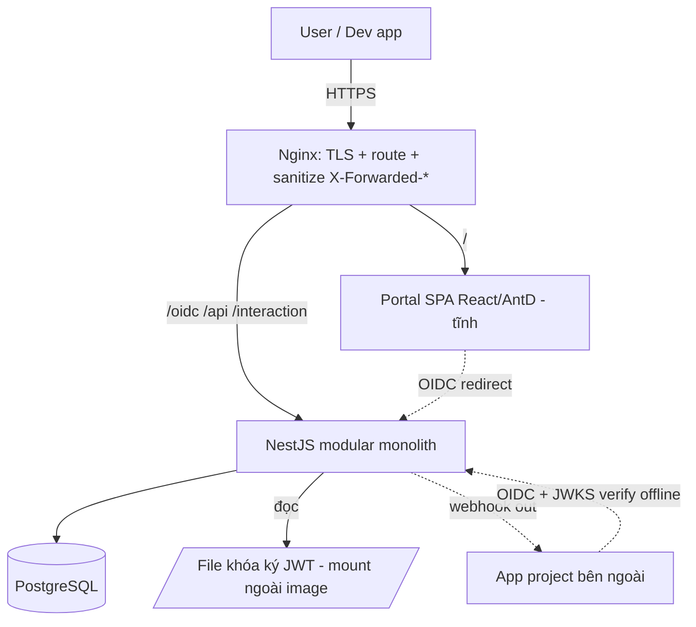

# Architecture Spine — PMH ID

Spine giữ các **bất biến** để nhiều người/agent xây các phần độc lập không lệch nhau. Chi tiết cấu trúc (cây thư mục, shape dữ liệu đầy đủ) là *seed* — đúng lúc khởi tạo, sau đó code sở hữu. Nguồn yêu cầu: `docs/prds/prd-sso-pmh-2026-07-04/prd.md` (final) + `addendum.md`.

## Paradigm & bối cảnh

**Modular monolith** — một ứng dụng NestJS chia module rõ ràng, một Postgres, đứng sau một Nginx, tất cả trong Docker Compose on-premise và expose ra internet. Quy mô ~1000 user, 3–5 project, 2 người vận hành. Nguyên tắc chủ đạo: **gọn để hai người debug được lúc 2h sáng** — không thêm hạ tầng nào chưa chứng minh cần.

## Inherited Invariants (từ PRD — binding, không re-decide)

- Tự quản mật khẩu (không AD/LDAP, không federate Google). OIDC Authorization Code; project verify JWT **offline** qua JWKS.
- `client_groups` là **nguồn sự thật duy nhất** của quyền truy cập; không có quan hệ "group↔project" tách rời.
- Vai trò: 2 SSA + project_admin (phạm vi project được phân công); soft-delete user; **MFA bắt buộc cho SSA**.
- Idle 15' bám phiên SSO thật; access token ngắn; thu hồi phân theo thẩm quyền (SSA toàn cục / project_admin phạm vi project / user tự đổi giữ phiên hiện tại).
- Public internet là bắt buộc (làm việc từ xa).

## Kiến trúc quyết định (AD)

### AD-1 — Modular monolith, một process NestJS `[ADOPTED]`
**Binds:** mọi tính năng là một module trong cùng một app NestJS (auth/oidc, users, groups, projects/clients, directory-api, audit, jobs, settings, notifications). **Prevents:** phân mảnh microservice vượt năng lực vận hành 2 người. **Rule:** không tách service mạng mới trừ khi có nhu cầu scale đã chứng minh; giao tiếp giữa module là gọi hàm in-process, không qua HTTP nội bộ. **Phân quyền xem theo phạm vi (FR-30 audit, FR-14 export):** module audit gắn `audit_logs.project_id`; project_admin lọc theo project được phân công (NULL = toàn cục, chỉ SSA); export CSV cũng scope theo cùng quy tắc phạm vi.

### AD-2 — Monorepo, hợp đồng dùng chung `[ADOPTED]`
**Binds:** một repo chứa `sso-server` (NestJS), `portal-fe` (React/AntD), `demo-app` (Node/Express), và `shared` (kiểu JWT claims + hợp đồng API). **Prevents:** lệch hợp đồng giữa FE–BE và giữa các project. **Rule:** cấu trúc JWT claims và hợp đồng Directory API chỉ định nghĩa một nơi trong `shared`, mọi bên import từ đó; đổi hợp đồng phá vỡ phải tăng `ver`.

### AD-3 — Tách FE tĩnh / BE API, chung domain `[ADOPTED]`
**Binds:** `id.pmh.com.vn` — `/` phục vụ SPA React tĩnh; `/api`, `/interaction/*` (JSON API cho bước interaction), `/docs` là NestJS; `/oidc/*` do `oidc-provider` xử lý. **Prevents:** trộn build FE vào BE. **Rule:** khi `oidc-provider` redirect tới `/interaction/:uid`, **Nginx trả `index.html` của React SPA** cho path đó → SPA render form login/consent → SPA gọi **API `/api/interaction/:uid`** (NestJS) để submit. Tức: *BE cung cấp API interaction, FE render UI* — không có trang login server-rendered riêng. `/docs` (FR-33) đặt sau đăng nhập, gate bằng membership group **"Developers"** — kiểm ở BE, không phải magic-string ở FE.

### AD-4 — Nginx là điểm vào duy nhất, app tin proxy `[ADOPTED]`
**Binds:** Nginx làm TLS termination + route + **sanitize `X-Forwarded-*`**; app đặt `provider.proxy = true`. **Prevents:** issuer ra `http`, cookie `secure` lỗi, giả mạo IP/proto. **Rule:** không service nào expose trực tiếp ra ngoài Nginx; issuer luôn `https`.

### AD-5 — `oidc-provider` v9 là lõi OIDC, pin version
**Binds:** dùng thư viện `oidc-provider` (npm, panva) dòng v9.x cho toàn bộ luồng OIDC (authorize/token/jwks/userinfo/logout), bật `features.clientCredentials`. **Prevents:** tự viết lõi crypto/OIDC. **Rule:** **pin đúng version tới patch** (cả Node engine patch) — theo dõi CVE, chuẩn bị sẵn quy trình dựng image vá và người chịu trách nhiệm fork (rủi ro một-maintainer, xem AD-16). v9 **ESM-only** trong khi NestJS CJS → nhúng provider qua **dynamic `import()`** (điểm interop bắt buộc). Không tự sửa lõi thư viện; mở rộng qua config/adapter/interactions.

### AD-6 — Postgres là store duy nhất; tự viết OIDC Adapter
**Binds:** một PostgreSQL giữ mọi state — dữ liệu nghiệp vụ (users/groups/clients/audit...) và artifact OIDC (session/token/grant/code). Không Redis. **Khóa ký JWT KHÔNG nằm trong DB** (xem AD-8 — file mount). **Prevents:** phân mảnh nguồn sự thật, thêm hạ tầng. **Rule:**
- Tự viết `Adapter` cho `oidc-provider` (upsert/find/findByUid/findByUserCode/consume/destroy/revokeByGrantId), tự lo TTL và index theo `uid`/`grantId`.
- **`consume()` phải atomic** (`UPDATE ... WHERE consumed IS NULL RETURNING`) và **`revokeByGrantId` chạy trong một transaction xóa trọn** session+access+refresh+code cùng grant — nếu không, replay-detection (AD-7) và kill-switch FR-05 thành vô nghĩa. Bắt buộc có test replay + test thu hồi, đối chiếu hành vi chuẩn của `oidc-provider` trước golive.
- **Thu hồi phân thẩm quyền (FR-05)** cần map `grant → client → project`: mỗi grant/session gắn `client_id`; "hủy phạm vi project" = revoke các grant có client thuộc project đó; "hủy toàn cục" (SSA) = revoke mọi grant của user; "user tự đổi mật khẩu" = revoke mọi grant TRỪ session hiện tại. Đây là invariant, không phải chi tiết.

### AD-7 — Phiên: idle 15' + cap tuyệt đối, tự triển khai
**Binds:** thư viện không tách sẵn idle vs absolute → lưu `auth_time` + `last_seen_at` trong Session (`oidc_payloads`), tính trong hàm `ttl.Session`. **Prevents:** phiên bất tử do refresh ngầm trượt cửa sổ. **Rule:**
- Idle timeout (mặc định 15') reset **chỉ khi user tương tác thật tại IdP**, không reset bởi refresh token ngầm; cap tuyệt đối (mặc định 12h); access token ngắn (mặc định 5').
- **Refresh token trói vào Session:** mỗi lần dùng refresh, kiểm Session còn hợp lệ (idle + cap) *tại thời điểm đó*; refresh validity ≤ absolute cap; hết phiên → refresh bị từ chối. Chữ "sliding" là hệ quả của Session còn sống, KHÔNG phải TTL refresh tự trượt độc lập. `rotateRefreshToken` bật (replay detection thu hồi cả grant).
- **Nguồn sự thật của phiên là Session trong `oidc_payloads`.** Bảng `sessions` (schema) là **projection một chiều** phục vụ self-service FR-10 (liệt kê/đăng xuất phiên) — mọi revoke đi qua `revokeByGrantId` trên `oidc_payloads`, `sessions` chỉ mirror. Không được để `sessions` thành nguồn sự thật thứ hai.
- Mọi mốc thời gian lưu UTC; nếu `auth_time`/`last_seen_at` thiếu → coi phiên hết hạn ngay (**fail-closed**), không để phép trừ NaN sinh phiên bất tử.

### AD-8 — Rotate khóa ký: mảng khóa thủ công + quy trình 2 bước
**Binds:** `jwks.keys` là mảng nhiều khóa, `kid` tự sinh, JWKS publish tất cả để verify. Khóa **lưu file mount ngoài image/git** (đây là nguồn sự thật của khóa ký, KHÔNG lưu trong DB). **Prevents:** gãy token đang sống khi đổi khóa; không có auto-rotation. **Rule:**
- Rotate theo thứ tự **publish-trước-ký-sau**: thêm khóa mới cuối mảng → reload mọi instance → **chờ ≥ thời gian JWKS cache của client** để mọi bên đã thấy `kid` mới → mới đưa khóa mới lên đầu (bắt đầu ký). Đảo thứ tự này (ký trước khi publish) làm project verify offline fail hàng loạt.
- Giữ khóa cũ để verify **≥ (TTL access token + JWKS cache TTL của client)**, không chỉ TTL access — gỡ sớm làm token còn hạn bỗng invalid. **Max JWKS cache TTL của client = 10 phút, ràng buộc trong hợp đồng tích hợp (`shared`/docs)** — SSA dùng con số này để tính cửa sổ overlap (vd overlap an toàn = 5' access + 10' cache = 15'); không có số mandate thì SSA không biết chờ bao lâu là đủ.
- Trong cụm nhiều instance, chỉ một quy trình rotate tại một thời điểm; quyền đọc file khóa hạn chế; **backup khóa mã hóa at-rest, cùng nhịp với backup DB** (xem AD-16). CLI rút khóa lộ khẩn cấp; access token ngắn là công cụ giới hạn thiệt hại khi lộ.

### AD-9 — Chống dò mật khẩu ở tầng app, bất đối xứng
**Binds:** guard/middleware NestJS dùng bảng `login_attempts`, phủ **cả** trang login (interaction) **và** `/oidc/token` (chống brute `client_secret`, theo `client_id`+IP). **Prevents:** password-spraying xuyên thủng, brute secret ở token endpoint, và khóa cứng tài khoản người thật (đặc biệt SSA). **Rule:** làm **backoff tăng dần theo account trước** (không lockout cứng); thêm lớp đếm/chặn theo IP theo metric thật (đừng cố định ngưỡng — xem Deferred); **tài khoản SSA không bao giờ bị khóa bởi tác nhân ngoài**; endpoint quên-mật-khẩu trả thông báo đồng nhất (không lộ email tồn tại). Tham số nằm trong Settings.

### AD-10 — MFA cho SSA: TOTP + recovery + break-glass `[ADOPTED]`
**Binds:** SSA đăng nhập phải qua TOTP (bước interaction sau password); `totp_secret` mã hóa. **Prevents:** chiếm SSA bằng một cú phishing; tự khóa mình khi mất thiết bị. **Rule:** mỗi SSA có recovery code **in giấy cất két** + một **tài khoản break-glass offline** (không MFA, mật khẩu dài cất riêng). project_admin/user thường: MFA để phase sau.

### AD-11 — Directory API M2M dùng client_secret `[ADOPTED]`
**Binds:** project lấy token qua client-credentials với `client_secret` (basic/post). **Prevents:** rào cản tích hợp phá mục tiêu dev-tự-tích-hợp-≤1-ngày. **Rule:** secret **hash** khi lưu; scope kết quả theo `client_groups` của client; không bao giờ trả dữ liệu mật khẩu; user `deleted` ẩn mặc định (`include_deleted` để đối soát). **`allow_all_groups` (quyền LOGIN) KHÔNG tự nới scope đọc Directory** — quyền đọc danh bạ vẫn giới hạn theo `client_groups` thật; tách rõ "login access" khỏi "directory read". Directory API có **rate-limit + audit truy vấn lớn** để một secret rò không dump trọn 1000 PII im lặng.

### AD-12 — Rotate client_secret có ân hạn, tách khỏi thu-hồi
**Binds:** bảng `client_secrets` cho phép nhiều secret song song (`active`/`retiring`). **Prevents:** rotate làm gãy app prod đang chạy. **Rule:** rotate = thêm secret mới `active` + đặt secret cũ `retiring` với hạn cấu hình được; **nút "thu hồi ngay" riêng** cho trường hợp lộ; cron dọn secret hết hạn.

### AD-13 — Xử lý nền: scheduler + queue trên Postgres
**Binds:** `@nestjs/schedule` cho cron (auto-lock `expires_at` + email cảnh báo T-N ngày; nén audit tháng; **dọn TTL `oidc_payloads` hết hạn**); email (`email_queue`) + webhook retry (`webhook_deliveries`) qua **bảng hàng đợi Postgres** + worker in-process. **Prevents:** thêm Redis; user chờ khi import CSV; mất webhook khi bên nhận chết; bảng token phình vô hạn. **Rule:**
- Worker lấy job bằng **`SELECT ... FOR UPDATE SKIP LOCKED`** + cột claim (`locked_at`) — vì gửi HTTP/SMTP không nằm trong transaction giữ lock được; an toàn kể cả khi lỡ chạy >1 instance, tránh gửi email/webhook trùng. Gửi email có throttle (nút cổ chai thật là Gmail SMTP); webhook retry giãn dần; `user_events` feed cho polling dự phòng (410 khi cursor quá 90 ngày).
- Scheduler/worker phải có **heartbeat**; cảnh báo khi job **pending quá tuổi** (không chỉ `failed`) — nếu không, event loop nghẽn làm auto-lock im lặng không chạy mà không ai hay.
- Queue để sau interface tách biệt (đổi ruột Redis được) nhưng **không xây khung queue tổng quát** cho quy mô này — `FOR UPDATE SKIP LOCKED` là đủ.

### AD-14 — Webhook egress chống SSRF trong app
**Binds:** validate `webhook_url` khi SSA lưu **và** khi gửi. **Prevents:** SSRF tới metadata/dịch vụ nội bộ. **Rule (Phase khi có webhook thật):** chỉ `https`; resolve DNS → chặn dải private (127/169.254/10/172.16/192.168/::1) + **allowlist CIDR nội bộ**; chặn redirect; ký payload HMAC-SHA256 bằng `webhook_secret`. `webhook_secret` **lưu mã hóa bằng KEK** (`webhook_secret_enc`, như `totp_secret` — AD-15), không lưu trần trong DB. **Quyền đặt/sửa `webhook_url`:** project_admin của project sở hữu client được đặt, nhưng giá trị luôn qua validate egress trên. *Phần **pin-IP + chống DNS-rebinding** hoãn (xem Deferred) — webhook là tùy chọn, chưa project nào dùng; mức https+CIDR+HMAC là đủ cho mối đe dọa thực ở quy mô nội bộ.*

### AD-15 — Cấu hình 2 tầng: .env (bí mật) vs Settings (runtime) `[ADOPTED]`
**Binds:** `.env` giữ bí mật hạ tầng (DB creds, **cookie keys `cookies.keys`**, SMTP creds, đường dẫn khóa ký, **KEK mã hóa TOTP secret**); bảng `settings` giữ tham số SSA chỉnh runtime (TTL, policy MK, hạn MK tạm, path backup, tham số chống dò). **Prevents:** bí mật lọt DB; lẫn cấu hình runtime với secrets; chiếm-container-là-đọc-được-TOTP. **Rule:** KEK bọc `totp_secret_enc` **tách khỏi tài sản nó bọc** (không nằm cùng bảng/DB với ciphertext). Thông tin cần để restore (path backup, creds) **không được chỉ nằm trong DB** — DB chết vẫn đọc được từ .env/tài liệu vận hành.

### AD-16 — Vận hành là ưu tiên Phase 1 (bus-factor 2 người)
**Binds:** cảnh báo chủ động khi mất auth (không chỉ `/health` thụ động); backup đêm; restore **diễn tập định kỳ**. **Prevents:** cả công ty kẹt đăng nhập khi SSO sập mà không ai hay; restore xong SSA vẫn kẹt; mất cả host không dựng lại được. **Rule:**
- **Backup phải trọn bộ để restore thật đăng nhập được**, cùng một nhịp đêm: pg_dump **+ .env (cookie keys, KEK TOTP) + file khóa ký**, tất cả mã hóa at-rest, đổ ra ổ/máy khác. Chỉ backup DB → restore xong `totp_secret_enc` thành rác, cookie signed vô nghĩa, **cả 2 SSA kẹt ngoài**.
- **Runbook dựng lại từ host trắng** (image + docker-compose + restore DB + khóa + .env) và **diễn tập break-glass login** — bấm đồng hồ ít nhất một lần trước golive; single host = mọi thứ chết chung, phải có đường về.
- **Kênh cảnh báo out-of-band:** cảnh báo mất-auth/job-nghẽn đi qua đường **NGOÀI hệ thống** (script/cron ngoài container → Telegram/Zalo), KHÔNG dùng email worker của chính PMH ID — vì SSO chết thì kênh email đó chết cùng, không ai được báo.
- Cookie `secure+httpOnly+signed` (bắt buộc `cookies.keys` trong .env); heartbeat scheduler (AD-13); kế hoạch khi 1/2 SSA vắng là một phần vận hành.

## Seed (đúng lúc cold-start, code sở hữu sau)

- **Cây monorepo:** `apps/sso-server` (NestJS), `apps/portal-fe` (React/Vite/AntD), `apps/demo-app` (Express), `packages/shared` (types + contract), `deploy/` (docker-compose + nginx.conf).
- **Stack:** NestJS + `oidc-provider` v9 + Postgres 16 + Argon2 + Nodemailer (Mailpit dev / Gmail SMTP prod) + `@nestjs/schedule`. Node 20.19+/22.12+.
- **Schema DB:** xem `docs/prds/prd-sso-pmh-2026-07-04/addendum.md` (users soft-delete, client_secrets, mfa_totp/recovery, user_events, sessions absolute cap, login_attempts, queue tables...).

## Deferred (không quyết ở đây)

- Thuật toán chống dò cụ thể (ngưỡng backoff, lớp chặn theo IP, có CAPTCHA hay không) — làm backoff-theo-account trước, thêm lớp IP theo metric thật (PRD + Anti-Consensus: đừng cargo-cult tầm Okta).
- **Webhook pin-IP + chống DNS-rebinding** (AD-14) — hoãn tới khi có project dùng webhook thật; giữ https+CIDR+HMAC. Kèm: re-pin/IP tĩnh cho dải nội bộ (tránh DHCP đổi IP làm webhook chết) và cảnh báo "secret sắp hết ân hạn mà app còn dùng" (AD-12) — cùng nhóm chờ webhook/tích hợp thật.
- Field mở rộng Directory API — chờ project thật.
- WAF/CDN ở biên (Cloudflare...) — tùy chọn triển khai, firewall công ty đã là một lớp.
- Bật MFA cho project_admin/user thường; single-logout toàn cục — phase sau.
- Chi tiết `clientAuthMethods` mặc định của oidc-provider — kiểm `defaults.js` của version pin khi cấu hình.
- Chiến lược đa-instance/HA (nếu sau này scale) — spine hiện tối ưu single-instance nhưng đã chốt các bất biến an-toàn-khi-lỡ-scale (AD-8 rotate ordering, AD-13 SKIP LOCKED); HA thật (nhiều node, load balancer) là quyết định sau.

## Open questions

- [ ] Version patch chính xác của `oidc-provider` v9 để pin (`npm view oidc-provider version` lúc khởi tạo).
- [ ] Dải CIDR nội bộ hợp lệ cho webhook egress allowlist (cần phối hợp IT hạ tầng).
- [ ] Tên miền các app project (topology path `/projectA` trên domain chung) ảnh hưởng redirect_uris — xác nhận khi có project thật.
